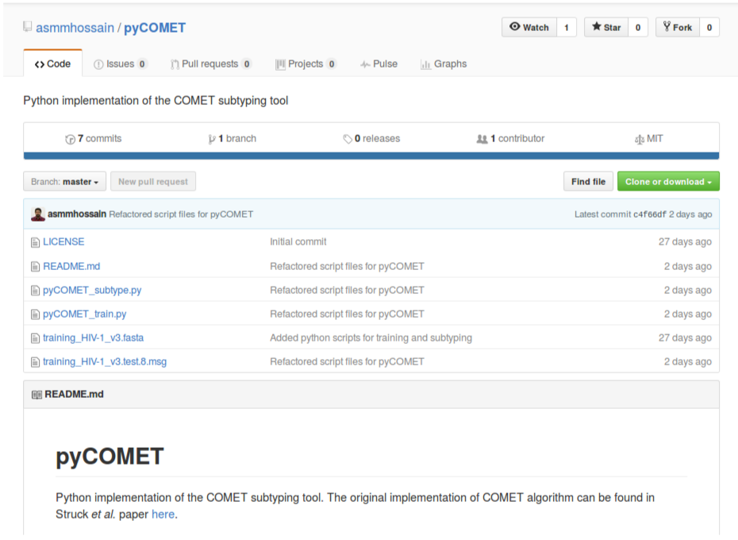
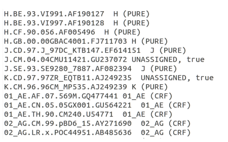
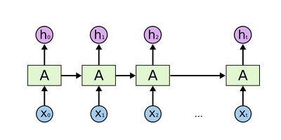

  
## Subtype classification using lossless compression techniques 
  
**Mukarram Hossain**
  
Department of Veterinary Medicine  
University of Cambridge
  
LVZ Retreat, 2017 
  
&nbsp;

---
  
### Lossless compression 
  
    
`Lossless compression is a class of data compression algorithms that allows the original data to be perfectly reconstructed from the compressed data.`

--- 
  
### Subtype classification
  
- Viruses are often grouped into subtypes.
- Subtypes have wide implications on the following studies of viruses:
    - clinical
    - epidemiological
    - structural
    - functional
- Existing classification techniques mostly rely on alignments followed by phylogenetic and/or statistical algorithms.

---

### Alignment uncertainty - 1 

&nbsp;

---

### Alignment uncertainty - 2

&nbsp;

---

### Alignment-free classification

- Lossless compression techniques have shown promising results for biological sequence classification:
  - Begleiter et al. (2004)
  - Ferragina et al. (2007)

---
  
  
&nbsp;

---
  
### COMET 
  
- COMET is an ultrafast alignment free subtyping tool
- Uses **P**rediction by **P**artial **M**atching (PPM)
- Initially designed for HIV-1
- COMET was tested on both synthetic (1090698) and clinical (10625) HIV datasets
- Sensitivity and specificity were comparable to or higher than:
    - REGA (de Oliveira *et al.*, 2005) and 
    - SCUEAL (Pond *et al.*, 2009)
- Detected and identified new recombinant forms

---

### PPM - model 

&nbsp;

---

### PPM - likelihoods

&nbsp;

---

### COMET algorithm

- Builds variable-order Markov models for each reference sequence
- Given a query, COMET calculates log likelihood of observing a base at each positions
- This results in a matrix of likelihood values
- Subtype call is done using a decision tree

---

### The decision tree

&nbsp;

---

### COMET - availability

- COMET is free to use via an [online](https://comet.lih.lu/) interface
- Stand-alone Java jar file can be requested from the author via <daniel.struck@lih.lu>

---

### pyCOMET

&nbsp;

---

### pyCOMET - results

&nbsp;

---

### Classification using Neural networks

- *Neural networks* are computational system mimicking biological brain
- Consists of a cluster of neural unit organised in layers

  
&nbsp;

---

### Classification using RNN

- Recurrent neural networks are networks with connections so that information can persist

  
&nbsp;

---

### Classification using lossless compression

- "*More accurate and more reliable*" and "*faster*" than current best methods.
- Robust, capable of identifying rare and novel recombinant forms.
- Results are consistent on short segments as well as whole genomes.
- Do not rely on alignments hence not biased by alignment uncertainty.
  
- Depends solely on the availability of complete reference sequence set

---

## Plans for 2017

---

&nbsp;

---

  

  
